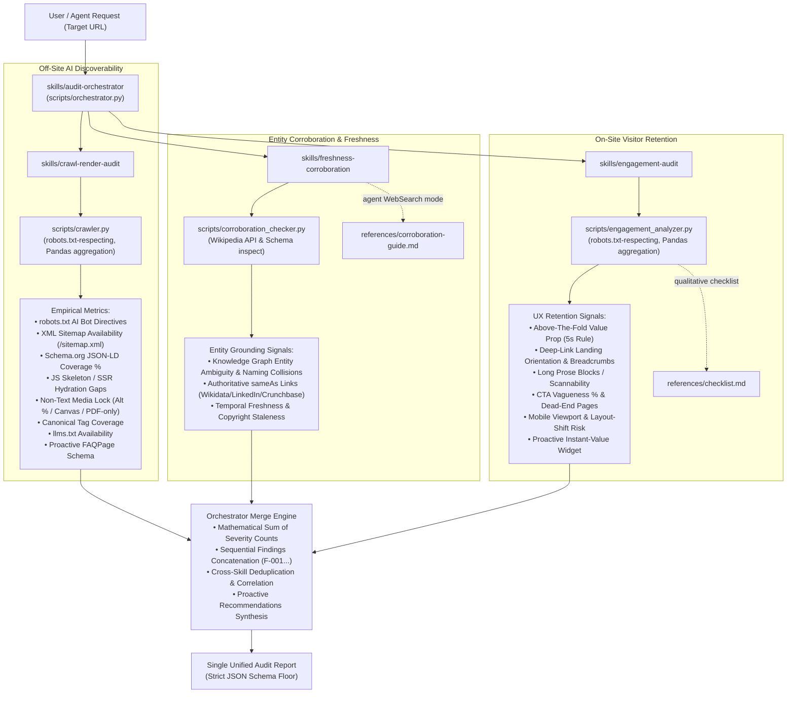

# Nexus Coders: Brand AI-Readiness & Engagement Audit Marketplace

> **Adobe University Hackathon 2026 — Round 3: Build the Agent Skill Marketplace**  
> An autonomous, multi-skill agent marketplace built strictly to the `agentskills.io` standard. Evaluates any website for **off-site AI discoverability** (getting found and cited by AI assistants), **cross-web entity corroboration & freshness** (trust, disambiguation, and non-staleness), and **on-site visitor engagement** (retaining visitors upon arrival), emitting prioritized, mechanism-sound fixes and proactive improvements.

---

## 1. Overview & System Mission

Modern search and information retrieval have shifted: AI assistants (ChatGPT, Claude, Perplexity, Gemini) act as autonomous answer engines. When an AI assistant evaluates a brand, three things must succeed:
1. **The crawler must be allowed in** (`robots.txt` AI directives, XML sitemaps).
2. **The crawler must be able to read facts** (structured JSON-LD, SSR vs client-side hydration, accessible text without canvas/PDF traps).
3. **The AI must trust and corroborate the brand** (cross-web knowledge graph links, non-colliding entity identity, freshness signals).

When an AI assistant cites a brand and sends a visitor through a deep link, the website must immediately orient and retain that visitor. If the landing page presents a confusing value proposition, skipped heading hierarchies, CTA friction, or a broken mobile viewport, the visitor bounces immediately.

The **Nexus Coders Brand Audit Marketplace** encodes this reasoning into reusable agent skills. Pointed at any URL, it autonomously crawls the target, analyzes signals using **Pandas**, and emits an evidence-backed audit report conforming to the required JSON schema floor.

---

## 2. Marketplace Architecture & Composition

The marketplace follows the `agentskills.io` standard with a clear separation of concerns across 4 focused skills:

```text
nexus-coders-brand-audit/
├── marketplace.json                <- Manifest listing all 4 skills and designating the entrypoint
├── requirements.txt                <- Declared dependencies (requests, beautifulsoup4, pandas)
├── LICENSE                         <- Apache-2.0 open-source license
├── README.md                       <- Marketplace documentation explaining composition and execution
└── skills/
    ├── audit-orchestrator/         <- [ENTRYPOINT] Coordinates audit pipeline & emits final JSON report
    │   ├── SKILL.md
    │   └── scripts/
    │       └── orchestrator.py     <- Master runner, dynamic resolver & mathematical merge engine
    ├── crawl-render-audit/         <- Dedicated skill for off-site AI readiness & crawlability
    │   ├── SKILL.md
    │   ├── scripts/
    │   │   └── crawler.py          <- Pandas-powered quantitative crawler & data analyzer
    │   └── references/
    ├── freshness-corroboration/    <- Dedicated skill for entity disambiguation & freshness
    │   ├── SKILL.md
    │   ├── scripts/
    │   │   └── corroboration_checker.py  <- Knowledge graph entity lookup & staleness detector
    │   └── references/
    │       └── corroboration-guide.md    <- Reference methodology for agent WebSearch spot-checks
    └── engagement-audit/           <- Dedicated skill for on-site visitor retention checks
        ├── SKILL.md
        ├── scripts/
        │   └── engagement_analyzer.py    <- Pandas-powered quantitative UX/retention analyzer
        └── references/
            └── checklist.md        <- Qualitative judgment-call guidelines (progressive disclosure)
```

All audit sub-skills are **self-contained and deterministic**: each performs its own read-only, `robots.txt`-respecting crawl (standard library `RobotFileParser`, polite crawl delay) and computes findings from concrete HTML signals via Pandas — neither depends on the other having run first, so either can be reused standalone outside this marketplace.

### Composition Flow



---

## 3. Skills Breakdown

### A. `audit-orchestrator` (Designated Entrypoint)
- **Role**: Coordinates the overall audit lifecycle and emits the single unified audit report.
- **Engine**: [scripts/orchestrator.py](skills/audit-orchestrator/scripts/orchestrator.py) — executes `crawler.py`, `corroboration_checker.py`, and `engagement_analyzer.py`, captures outputs, mathematically sums the severity counts (`total_findings`, `critical`, `high`, `medium`, `low`), and concatenates findings into a single sequentially-indexed array (`F-001`, `F-002`, ...).
- **Actions**:
  - Ingests and normalizes the target domain.
  - Dispatches tasks to all sub-skills with polite execution delays and SSL fallbacks.
  - Mathematically sums summary counts across sub-skills.
  - Concatenates findings and prevents duplicate ID collisions.
  - Synthesizes proactive "beyond-defect" suggestions.
  - Emits the validated, single unified JSON audit report.

### B. `crawl-render-audit` (Off-Site AI Readiness)
- **Role**: Tests whether AI retrieval bots can crawl, extract, and index canonical brand facts.
- **Engine**: [scripts/crawler.py](skills/crawl-render-audit/scripts/crawler.py) uses **Pandas** for vectorized metric aggregation:
  - `schema_coverage_pct = (df['has_schema'].sum() / len(df)) * 100`
  - `missing_alt_pct = (df['missing_alt_images'].sum() / df['total_images'].sum()) * 100`
  - `is_js_skeleton = (df['text_length'] < 250) & (raw_html contains SPA roots)`
- **Key Checks**: AI bot access (`GPTBot`, `ClaudeBot`, `PerplexityBot`), XML Sitemap declarations, `llms.txt`, Schema.org types (`Organization`, `Product`, `FAQPage`, `BreadcrumbList`), canonical tags, and non-text locks (alt text, canvas graphics, and PDF-only content). Discards HTTP error pages (404/500) to prevent false-positive noise.

### C. `freshness-corroboration` (Entity Corroboration & Freshness)
- **Role**: Determines whether the brand's entity identity is grounded in external knowledge graphs, tests for naming collisions, and inspects temporal freshness.
- **Engine**: [scripts/corroboration_checker.py](skills/freshness-corroboration/scripts/corroboration_checker.py) queries Wikipedia / Wikidata APIs to detect entity ambiguity, inspects Schema `sameAs` links, and checks `Last-Modified` headers and copyright timestamps.

### D. `engagement-audit` (On-Site Visitor Retention)
- **Role**: Tests why human visitors who arrive from AI citations stay or bounce.
- **Engine**: [scripts/engagement_analyzer.py](skills/engagement-audit/scripts/engagement_analyzer.py) crawls up to 10 interior pages to measure the "5-second rule" (H1 clarity), persistent navigation landmarks, breadcrumbs for deep arrivals, scannability (dense unbroken text), CTA dead-ends, and mobile viewport readiness.

---

## 4. How to Run an Audit

### 1. Single-Entrypoint Full Audit (Recommended)
Run the master orchestrator to execute all 3 sub-skills and emit the Single Unified Audit Report:
```bash
python3 skills/audit-orchestrator/scripts/orchestrator.py https://example.com --max-pages 15 --output unified_audit_report.json
```

### 2. Standalone Sub-Skill Execution
Each sub-skill can also be invoked independently as a portable CLI:
```bash
# Off-Site AI Discoverability
python3 skills/crawl-render-audit/scripts/crawler.py https://example.com --max-pages 15 --output discoverability_report.json

# Freshness & Knowledge Graph Corroboration
python3 skills/freshness-corroboration/scripts/corroboration_checker.py https://example.com --output corroboration_report.json

# On-Site Visitor Retention
python3 skills/engagement-audit/scripts/engagement_analyzer.py https://example.com --max-pages 10 --output engagement_report.json
```

### 3. Distributed Multi-Agent Merge Mode
In workflows where sub-skills are run concurrently by separate agents, merge their outputs using:
```bash
python3 skills/audit-orchestrator/scripts/orchestrator.py --from-files discoverability_report.json corroboration_report.json engagement_report.json --output unified_audit_report.json
```

---

## 5. Scope & Guardrails
- **Recommend-only**: No skill modifies a live website; everything is strictly read-only GET/HEAD requests.
- **Respects `robots.txt`**: Crawlers self-enforce standard `RobotFileParser` compliance and respect declared crawl delays.
- **Resilient & Portable**: SSL error fallback and timeout safety. Runs in < 1 minute on standard hardware.
- **Package Size**: Zero heavy model weights; complete marketplace is ~49 KB (limit: 50 MB).
