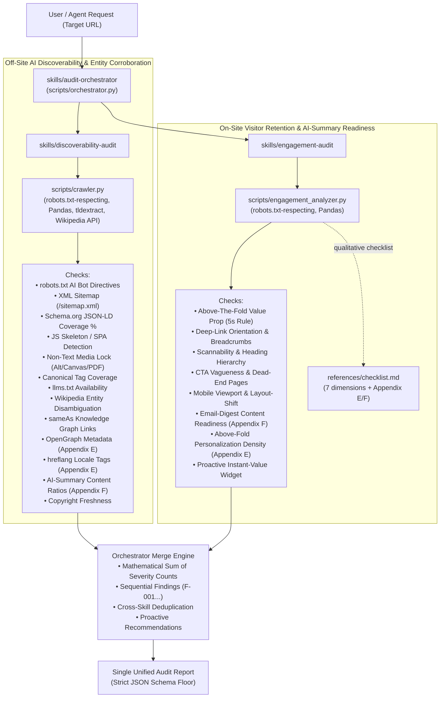

# Nexus Coders: Brand AI-Readiness & Engagement Audit Marketplace

> **Adobe University Hackathon 2026 — Round 3: Build the Agent Skill Marketplace**  
> An autonomous, multi-skill agent marketplace built strictly to the `agentskills.io` standard. Evaluates any website for **off-site AI discoverability** (crawlability, entity corroboration, freshness, AI-summary readiness), and **on-site visitor engagement** (retention, orientation, email-digest content readiness), emitting prioritized, mechanism-sound fixes with concrete code/directive examples.

---

## 1. Overview & System Mission

Modern information retrieval is driven by AI assistants (ChatGPT, Claude, Perplexity, Gemini) acting as autonomous answer engines. For a brand to be found, trusted, and correctly cited, three things must succeed:

1. **The crawler must be allowed in** — `robots.txt` AI directives, XML sitemaps, `llms.txt`.
2. **The crawler must be able to read facts** — structured JSON-LD, SSR vs client-side hydration, accessible text without canvas/PDF traps.
3. **The AI must trust, corroborate, and personalize the brand** — cross-web knowledge graph links, non-colliding entity identity, freshness signals, OpenGraph metadata, hreflang locale tags.

When an AI assistant cites a brand and sends a visitor through a deep link, the website must immediately orient and retain that visitor. And when the AI summarizes the brand in emails or chat, the key content must survive summarization (Appendix F).

The **Nexus Coders Brand Audit Marketplace** encodes this reasoning into reusable agent skills, operating as a clean two-concern decomposition matching the Round 2 problem statement:
- **Off-site discoverability** — why the brand isn't found or cited (merged with entity corroboration and freshness into one cohesive skill)
- **On-site engagement** — why visitors who do arrive don't stay (enhanced with AI-summary and email-digest readiness)

---

## 2. Marketplace Architecture & Composition

The marketplace follows the `agentskills.io` standard with genuine separation of concerns across 3 skills:

```text
nexus-coders-brand-audit/
├── marketplace.json                <- Manifest: 3 skills, 1 designated entrypoint
├── requirements.txt                <- Declared dependencies (requests, beautifulsoup4, pandas, tldextract)
├── LICENSE                         <- Apache-2.0 open-source license
├── README.md                       <- This documentation
└── skills/
    ├── audit-orchestrator/         <- [ENTRYPOINT] Coordinates audit pipeline & emits final JSON report
    │   ├── SKILL.md
    │   └── scripts/
    │       └── orchestrator.py     <- Master runner, dynamic resolver & mathematical merge engine
    ├── discoverability-audit/      <- Unified off-site AI readiness, entity corroboration & freshness
    │   ├── SKILL.md
    │   ├── scripts/
    │   │   └── crawler.py          <- Pandas-powered crawler, Wikipedia entity checker, tldextract brand parser
    │   └── references/
    │       └── corroboration-guide.md  <- Reference for agent WebSearch spot-checks
    └── engagement-audit/           <- On-site visitor retention & AI-summary readiness
        ├── SKILL.md
        ├── scripts/
        │   └── engagement_analyzer.py  <- Pandas-powered UX/retention/email-readiness analyzer
        └── references/
            └── checklist.md        <- Qualitative judgment-call guidelines (7 dimensions + Appendix E/F)
```

### Why 3 Skills (Not 4)

The PDF problem statement explicitly frames the audit as two halves: **off-site discoverability** and **on-site engagement**. Entity corroboration, freshness signals, and AI-summary readiness are aspects of the *same question* — "Can AI find and correctly cite this brand?" — so they belong in the discoverability skill, not as separate padding. This two-concern decomposition (plus the orchestrator entrypoint) reflects genuine separation of concerns.

### Composition Flow



---

## 3. Skills Breakdown

### A. `audit-orchestrator` (Designated Entrypoint)
- **Role**: Coordinates the overall audit lifecycle and emits the single unified audit report.
- **Engine**: [orchestrator.py](skills/audit-orchestrator/scripts/orchestrator.py) — executes `crawler.py` and `engagement_analyzer.py`, mathematically sums severity counts, concatenates and deduplicates findings, and emits the validated report.

### B. `discoverability-audit` (Off-Site AI Readiness + Entity Corroboration)
- **Role**: Tests whether AI retrieval bots can crawl, extract, trust, corroborate, and correctly cite brand facts.
- **Engine**: [crawler.py](skills/discoverability-audit/scripts/crawler.py) — unified auditor covering:
  - AI bot access, XML sitemaps, `llms.txt`, canonical tags
  - Schema.org JSON-LD structured data with **Pandas** vectorized aggregation
  - SPA/JS skeleton detection with improved framework-marker heuristics
  - Non-text content traps (alt text, canvas, PDF-only)
  - Wikipedia/Wikidata entity disambiguation via public OpenSearch API
  - `sameAs` knowledge graph link verification
  - Copyright/freshness staleness signals
  - **OpenGraph metadata** completeness for AI personalization (Appendix E)
  - **hreflang locale tags** for geographically personalized responses (Appendix E)
  - **AI-summary content ratios** — image-heavy pages poorly suited for email digests (Appendix F)
  - Brand name extraction via **tldextract** for TLD-aware domain parsing

### C. `engagement-audit` (On-Site Visitor Retention + AI-Summary Readiness)
- **Role**: Tests why human visitors who arrive from AI citations stay or bounce, and whether content survives AI summarization.
- **Engine**: [engagement_analyzer.py](skills/engagement-audit/scripts/engagement_analyzer.py) — 7 engagement dimensions:
  - H1 clarity, breadcrumbs, scannability, CTA friction, mobile viewport, layout-shift risk
  - **Email-digest content readiness** — pages with high image-to-text ratios (Appendix F)
  - **Above-the-fold personalization density** — substantive first-visible text for AI matching (Appendix E)

---

## 4. How to Run an Audit

### 1. Single-Entrypoint Full Audit (Recommended)
```bash
python3 skills/audit-orchestrator/scripts/orchestrator.py https://example.com --max-pages 15 --output unified_audit_report.json
```

### 2. Standalone Sub-Skill Execution
```bash
# Off-Site AI Discoverability + Entity Corroboration
python3 skills/discoverability-audit/scripts/crawler.py https://example.com --max-pages 15 --output discoverability_report.json

# On-Site Visitor Retention + AI-Summary Readiness
python3 skills/engagement-audit/scripts/engagement_analyzer.py https://example.com --max-pages 10 --output engagement_report.json
```

### 3. Distributed Multi-Agent Merge Mode
```bash
python3 skills/audit-orchestrator/scripts/orchestrator.py --from-files discoverability_report.json engagement_report.json --output unified_audit_report.json
```

---

## 5. Scope & Guardrails
- **Recommend-only**: No skill modifies a live website; everything is strictly read-only GET/HEAD requests.
- **Respects `robots.txt`**: Crawlers self-enforce `RobotFileParser` compliance and respect declared crawl delays.
- **Resilient & Portable**: SSL error fallback and timeout safety. Runs in < 2 minutes on standard hardware.
- **Package Size**: Zero heavy model weights; complete marketplace is ~60 KB (limit: 50 MB).

---

## 6. PDF Appendix Coverage

| PDF Appendix | How Addressed | Skill |
|---|---|---|
| **A. Search Visibility** | robots.txt AI bot checks, XML sitemap, crawler access | `discoverability-audit` |
| **B. How Assistants Use Sources** | Schema.org JSON-LD, `llms.txt`, FAQPage proactive | `discoverability-audit` |
| **C. How Machines Read a Page** | JS skeleton/SPA detection, non-text traps (canvas/PDF/alt), text ratio | `discoverability-audit` |
| **D. Agreement Across the Web** | Wikipedia entity disambiguation, `sameAs` knowledge graph links, freshness | `discoverability-audit` |
| **E. Personalization & Prior Context** | OpenGraph metadata, hreflang locale tags, above-fold content density | Both skills |
| **F. Why Machines Drop Email Content** | AI-summary content ratios, image-to-text analysis, email-digest readiness | Both skills |
