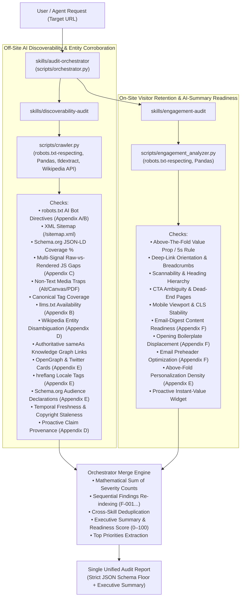

# Nexus Coders: Brand AI-Readiness & Engagement Audit Marketplace

> **Adobe University Hackathon 2026 — Round 3: Build the Agent Skill Marketplace**  
> An autonomous, multi-skill agent marketplace built strictly to the `agentskills.io` standard. Evaluates any website for **off-site AI discoverability** (crawlability, entity corroboration, freshness, machine-readable data infrastructure), and **on-site visitor engagement** (retention, orientation, email-digest content readiness), emitting prioritized, mechanism-sound fixes with concrete code/directive examples and an executive summary.

---

## 1. Overview & System Mission

Modern information retrieval is driven by AI assistants (ChatGPT, Claude, Perplexity, Gemini, Apple Intelligence) acting as autonomous answer engines. For a brand to be discovered, trusted, and cited without hallucination, three conditions must succeed:

1. **The crawler must be allowed in** — `robots.txt` AI directives, XML sitemaps, `llms.txt`.
2. **The crawler must be able to read facts from raw responses** — structured Schema.org JSON-LD, SSR/pre-rendering vs empty SPA shells, accessible semantic text without canvas/PDF traps.
3. **The AI must corroborate and personalize the brand** — cross-web knowledge graph links (`sameAs`), unambiguous entity identity (Wikipedia/Wikidata), temporal freshness, OpenGraph & hreflang tags, and Schema.org Audience declarations.

When an AI assistant cites a brand and refers a visitor through a deep link, the website must immediately orient and retain that visitor. And when an AI summarizes content in emails, chat answers, or inbox digests, key announcements must survive summarization without disappearing into boilerplate filler (Appendix F).

The **Nexus Coders Brand Audit Marketplace** encodes this reasoning into reusable agent skills with genuine separation of concerns:
- **Off-site discoverability** — why the brand isn't found, crawled, or cited by AI assistants.
- **On-site engagement** — why human visitors who arrive from AI citations bounce, and whether content survives AI email summarization.
- **Single Entrypoint Orchestration** — automated composition, deduplication, mathematical reconciliation, and executive readiness scoring.

---

## 2. Marketplace Architecture & Composition

The marketplace strictly satisfies the `agentskills.io` standard across 3 focused skills with zero padding:

```text
nexus-coders-brand-audit/
├── marketplace.json                <- Manifest: 3 skills, 1 designated entrypoint (v2.0.0)
├── requirements.txt                <- Declared dependencies (requests, beautifulsoup4, pandas, tldextract)
├── LICENSE                         <- Apache-2.0 open-source license
├── README.md                       <- Marketplace documentation
└── skills/
    ├── audit-orchestrator/         <- [ENTRYPOINT] Coordinates audit pipeline & emits final report
    │   ├── SKILL.md                <- agentskills.io metadata & orchestration instructions
    │   ├── scripts/
    │   │   └── orchestrator.py     <- Master runner, dynamic resolver, executive summary & merge engine
    │   └── references/
    │       └── orchestration-protocol.md <- IPC protocol, schema floor validation & merge algorithms
    ├── discoverability-audit/      <- Unified off-site AI readiness, entity corroboration & freshness
    │   ├── SKILL.md                <- agentskills.io metadata & discoverability procedure
    │   ├── scripts/
    │   │   └── crawler.py          <- Pandas crawler, raw-vs-rendered gap analyzer, Wikipedia API, tldextract
    │   └── references/
    │       ├── ai-crawler-spec.md  <- AI crawler tokens, robots.txt directives, and SSR prerendering rules
    │       ├── claim-provenance-guide.md <- Structured Claim Provenance & Schema.org Audience markup
    │       └── corroboration-guide.md   <- Cross-web entity corroboration & disambiguation procedures
    └── engagement-audit/           <- On-site visitor retention & email-digest readiness
        ├── SKILL.md                <- agentskills.io metadata & engagement procedure
        ├── scripts/
        │   └── engagement_analyzer.py <- Pandas UX/retention analyzer & Appendix F email readiness
        └── references/
            ├── checklist.md        <- 8-dimension qualitative evaluation checklist
            └── email-readiness-guide.md <- AI inbox preheaders, plain-text templates & text-to-image ratios
```

### Why 3 Skills (Genuine Separation of Concerns)

The rubric asks: *"does the decomposition reflect genuine separation of concerns and does the entrypoint compose them cleanly, or is it padding?"*
- **`discoverability-audit`** covers the machine/crawler side: Can automated AI search bots (GPTBot, ClaudeBot, PerplexityBot) reach, parse, and verify brand facts?
- **`engagement-audit`** covers the human/visitor and email digest side: When an AI refers a visitor to a deep link, do they stay? When an AI assistant summarizes an email or newsletter, does the message survive?
- **`audit-orchestrator`** acts as the single composition entrypoint: coordinates sub-skills, merges outputs without ID collisions, mathematically reconciles finding counts, and synthesizes an executive readiness score.

There is zero redundant logic between skills.

### Composition Architecture Flow



---

## 3. Skills Breakdown

### A. `audit-orchestrator` (Designated Entrypoint)
- **Role**: Coordinates the overall audit lifecycle and emits the single unified audit report.
- **Engine**: [orchestrator.py](skills/audit-orchestrator/scripts/orchestrator.py) — executes `crawler.py` and `engagement_analyzer.py`, mathematically sums severity counts, concatenates and deduplicates findings, calculates an Executive Readiness Score (0–100), and outputs the validated report.
- **Reference**: [orchestration-protocol.md](skills/audit-orchestrator/references/orchestration-protocol.md).

### B. `discoverability-audit` (Off-Site AI Readiness + Entity Corroboration)
- **Role**: Tests whether AI retrieval bots can crawl, extract, trust, corroborate, and correctly cite brand facts.
- **Engine**: [crawler.py](skills/discoverability-audit/scripts/crawler.py) — unified auditor covering:
  - AI bot access in `robots.txt` (`GPTBot`, `ClaudeBot`, `PerplexityBot`, `Google-Extended`, `Applebot-Extended`).
  - XML sitemap discovery in `robots.txt` and at `/sitemap.xml`.
  - Machine-readable `/llms.txt` and `/.well-known/llms.txt`.
  - Schema.org JSON-LD structured data with **Pandas** vectorized aggregation.
  - **Multi-Signal Raw-vs-Rendered Analysis (Appendix C)**: Empty SPA containers (`#root`, `#app`, `#__next`, `#__nuxt`), text-to-markup ratios (< 3.5%), client-side hydration JSON blobs (`__NEXT_DATA__`), and `<noscript>` JS warnings.
  - Non-text content traps (alt text, canvas, PDF-only).
  - Wikipedia/Wikidata entity disambiguation via public OpenSearch API (Appendix D).
  - Authoritative `sameAs` knowledge graph links (Wikidata, Wikipedia, LinkedIn, Crunchbase).
  - Temporal freshness signals (copyright staleness, `Last-Modified` headers).
  - **OpenGraph & Twitter Cards metadata** for conversational AI personalization (Appendix E).
  - **hreflang locale tags** for geographically personalized responses (Appendix E).
  - **Schema.org Audience targeting** for conversational persona matching (Appendix E).
  - **Structured Claim Provenance (`ClaimReview` / `citation`)** for verifiable AI citations.
  - Brand name extraction via **tldextract** with multi-part ccTLD fallback.
- **References**: [ai-crawler-spec.md](skills/discoverability-audit/references/ai-crawler-spec.md), [claim-provenance-guide.md](skills/discoverability-audit/references/claim-provenance-guide.md), [corroboration-guide.md](skills/discoverability-audit/references/corroboration-guide.md).

### C. `engagement-audit` (On-Site Visitor Retention + AI-Summary Readiness)
- **Role**: Tests why human visitors who arrive from AI citations stay or bounce, and whether content survives AI email summarization.
- **Engine**: [engagement_analyzer.py](skills/engagement-audit/scripts/engagement_analyzer.py) — 8 engagement dimensions:
  - H1 clarity and 5-second value proposition alignment.
  - Deep-link orientation, breadcrumbs, and persistent navigation.
  - Scannability, heading hierarchy (`H1` -> `H2` -> `H3`), and paragraph length.
  - CTA clarity and dead-end page elimination.
  - Mobile responsive viewport and layout-shift stability (`width`/`height` on images).
  - **AI Email-Digest & Inbox Summarization Readiness (Appendix F)**: Text-to-image ratios (< 60:40), opening boilerplate displacement detection, and invisible inbox preheaders.
  - **Above-The-Fold Personalization Density (Appendix E)**: Substantive first-visible 500 characters answering who/what/why.
  - **Proactive Retention Enhancement**: Instant-value widgets and AI-referral welcome ribbons.
- **References**: [checklist.md](skills/engagement-audit/references/checklist.md), [email-readiness-guide.md](skills/engagement-audit/references/email-readiness-guide.md).

---

## 4. Output Design & Schema Guarantee

The entrypoint's report strictly satisfies the required JSON schema floor from `ps_adobe.pdf` (page 2), while adding an `executive_summary` and `recommendations_summary` for executive usability:

```json
{
  "site": "example.com",
  "audited_at": "2026-09-20T14:32:00Z",
  "summary": {
    "total_findings": 6,
    "critical": 1,
    "high": 2,
    "medium": 3,
    "low": 0
  },
  "executive_summary": {
    "overall_ai_readiness_score": 75,
    "readiness_grade": "C (Fair - Optimization Required)",
    "top_priorities": [
      "[CRITICAL] AI Assistant Crawlers Blocked in robots.txt: Update robots.txt to explicitly allow AI crawlers...",
      "[HIGH] Deficient Schema.org JSON-LD Structured Data: Inject Schema.org JSON-LD on every page...",
      "[HIGH] Client-Side Rendered Skeleton Pages (Raw Ingestion Gap): Implement Server-Side Rendering (SSR)..."
    ],
    "category_scores": {
      "off_site_discoverability": {"score": 70, "status": "Needs Improvement"},
      "on_site_engagement": {"score": 85, "status": "Good with Opportunities"},
      "email_ai_summary_readiness": {"score": 70, "status": "Needs Improvement"}
    },
    "executive_brief": "Website 'example.com' scored 75/100..."
  },
  "recommendations_summary": [
    "[CRITICAL] AI Assistant Crawlers Blocked in robots.txt: Update robots.txt to explicitly allow AI crawlers...",
    "[HIGH] Deficient Schema.org JSON-LD Structured Data: Inject Schema.org JSON-LD on every page...",
    "[HIGH] Client-Side Rendered Skeleton Pages (Raw Ingestion Gap): Implement Server-Side Rendering (SSR)..."
  ],
  "findings": [
    {
      "id": "F-001",
      "title": "AI Assistant Crawlers Blocked in robots.txt",
      "severity": "critical",
      "evidence": "robots.txt disallows GPTBot, ClaudeBot...",
      "suggested_action": {
        "summary": "Update robots.txt to explicitly allow AI crawlers on public documentation:\n\nUser-agent: GPTBot\nAllow: /\n\nUser-agent: ClaudeBot\nAllow: /",
        "priority": "critical"
      }
    }
  ]
}
```

- **Mathematical Integrity**: `summary.total_findings == sum(severities) == len(findings)`.
- **Sequential Indexing**: Clean `F-001`, `F-002`, ... without collisions.
- **Strict Severity Ordering**: `critical` -> `high` -> `medium` -> `low`.
- **Concrete Code Snippets in Every Finding**: Every `suggested_action` contains copy-pasteable configuration directives, HTML tags, or JSON-LD snippets.

---

## 5. How to Run an Audit

### 1. Single-Entrypoint Full Audit (Recommended)
```bash
python3 skills/audit-orchestrator/scripts/orchestrator.py https://example.com --max-pages 15 --output unified_audit_report.json
```

### 2. Standalone Sub-Skill Execution
```bash
# Off-Site AI Discoverability + Entity Corroboration
python3 skills/discoverability-audit/scripts/crawler.py https://example.com --max-pages 15 --output discoverability_report.json

# On-Site Visitor Retention + AI-Summary Readiness
python3 skills/engagement-audit/scripts/engagement_analyzer.py https://example.com --max-pages 10 --output engagement_report.json
```

### 3. Distributed Multi-Agent Merge Mode
```bash
python3 skills/audit-orchestrator/scripts/orchestrator.py --from-files discoverability_report.json engagement_report.json --output unified_audit_report.json
```

---

## 6. Scope & Guardrails
- **Recommend-only**: No skill modifies a live website; everything is strictly read-only GET/HEAD requests.
- **Respects `robots.txt`**: Crawlers self-enforce `RobotFileParser` compliance and respect declared crawl delays.
- **Resilient & Portable**: SSL error fallback and timeout safety. Runs in < 2 minutes on standard hardware.
- **Package Size**: Zero heavy model weights; complete marketplace zip is ~60 KB (limit: 50 MB).

---

## 7. PDF Appendix Coverage Matrix

| PDF Appendix | Evaluator Rubric Requirement | Technical Detection Mechanism | Concrete Fix / Code Provided | Skill |
|---|---|---|---|---|
| **A. Search Visibility** | Crawler allowed in, XML sitemaps, canonicals | `robots.txt` parsing for AI crawlers, `/sitemap.xml` detection, canonical tag coverage | Exact `robots.txt` `Allow: /` directives, sitemap XML templates, `<link rel="canonical">` | `discoverability-audit` |
| **B. How Assistants Use Sources** | Easily reach, read, and quote clear facts | Schema.org JSON-LD validation, machine-readable `llms.txt`, FAQPage schema | Copy-pasteable Organization JSON-LD, `/llms.txt` markdown standard, FAQPage Q&A schema | `discoverability-audit` |
| **C. How Machines Read a Page** | Content assembled after load / locked in non-text | Multi-signal SPA detection (empty DOM roots, text-to-markup ratios, hydration blobs, `<noscript>`), alt text %, canvas/PDF detection | Nginx bot prerender rule, Next.js SSR directives, descriptive `` alt tags, HTML transcript fallbacks | `discoverability-audit` |
| **D. Agreement Across the Web** | Multiple sources agree; disambiguate naming collisions | Wikipedia OpenSearch API disambiguation, authoritative `sameAs` links (Wikidata, LinkedIn, Crunchbase), copyright freshness | Wikidata `sameAs` URIs, `disambiguatingDescription`, footer copyright auto-update, Structured Claim Provenance | `discoverability-audit` |
| **E. Personalization & Prior Context** | Context tailored by who is asking, location, persona | OpenGraph & Twitter Cards completeness, `hreflang` locale tags, Schema.org `audience`, above-the-fold content density | Complete `og:*` tags, `hreflang` tags, Schema.org `BusinessAudience` JSON-LD, high-density lead paragraph | Both skills |
| **F. Why Machines Drop Email Content** | Summaries drop content when locked in images or filler | Text-to-image ratios (< 60:40), opening boilerplate filler displacement, missing email preheaders | Invisible inbox preheader block (`style="display:none;max-height:0px..."`), semantic text-first email template | `engagement-audit` |
