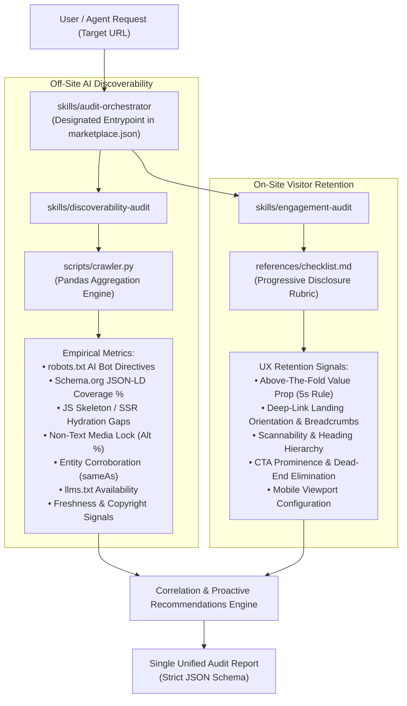

# Nexus Coders: Brand AI-Readiness & Engagement Audit Marketplace

> **Adobe University Hackathon 2026 — Round 3: Build the Agent Skill Marketplace**  
> An autonomous, multi-skill agent marketplace built to the `agentskills.io` standard. Evaluates any website for **off-site AI discoverability** (getting cited by AI assistants) and **on-site visitor engagement** (retaining visitors upon arrival), emitting prioritized, mechanism-sound fixes and proactive improvements.

---

## 1. Overview & System Mission

Modern search and information retrieval have shifted: AI assistants (ChatGPT, Claude, Perplexity, Gemini) act as autonomous answer engines. When an AI assistant evaluates a brand, three things must succeed:
1. **The crawler must be allowed in** (`robots.txt` AI directives).
2. **The crawler must be able to read facts** (structured JSON-LD, SSR vs client-side hydration, accessible text).
3. **The AI must trust and corroborate the brand** (cross-web knowledge graph links, freshness signals).

When an AI assistant cites a brand and sends a visitor through a deep link, the website must immediately orient and retain that visitor. If the landing page presents a confusing value proposition, skipped heading hierarchies, CTA friction, or a broken mobile viewport, the visitor bounces immediately.

The **Nexus Coders Brand Audit Marketplace** encodes this reasoning into reusable agent skills. Pointed at any URL, it autonomously crawls the target, analyzes signals using **Pandas**, and emits an evidence-backed audit report conforming to the required JSON schema.

---

## 2. Marketplace Architecture & Composition

The marketplace follows the `agentskills.io` standard with a clear separation of concerns across focused skills:

```text
nexus-coders-brand-audit/
├── marketplace.json                <- The manifest listing all skills and designating the entrypoint
├── README.md                       <- Root documentation explaining composition and execution
└── skills/
    ├── audit-orchestrator/         <- [ENTRYPOINT] Coordinates audit pipeline & emits final JSON report
    │   └── SKILL.md
    ├── discoverability-audit/      <- Dedicated skill for off-site AI readiness checks
    │   ├── SKILL.md
    │   └── scripts/
    │       └── crawler.py          <- Pandas-powered quantitative crawler & data analyzer
    └── engagement-audit/           <- Dedicated skill for on-site visitor retention checks
        ├── SKILL.md
        └── references/
            └── checklist.md        <- Granular guidelines keeping SKILL.md lean (progressive disclosure)
```

### Composition Flow



---

## 3. Skills Breakdown

### A. `audit-orchestrator` (Designated Entrypoint)
- **Role**: Coordinates the overall audit lifecycle.
- **Actions**:
  - Ingests and normalizes the target domain.
  - Dispatches tasks to `discoverability-audit` and `engagement-audit`.
  - Merges quantitative data with qualitative retention heuristics.
  - Synthesizes proactive "beyond-defect" suggestions.
  - Emits the validated JSON audit report.

### B. `discoverability-audit` (Off-Site AI Readiness)
- **Role**: Tests whether AI retrieval bots can crawl, extract, and corroborate facts.
- **Engine**: [scripts/crawler.py](skills/discoverability-audit/scripts/crawler.py) uses **Pandas** for vectorized metric aggregation:
  - `schema_coverage_pct = (df['has_schema'].sum() / len(df)) * 100`
  - `missing_alt_pct = (df['missing_alt_images'].sum() / df['total_images'].sum()) * 100`
  - `is_js_skeleton = (df['text_length'] < 250) & (raw_html contains SPA roots)`
- **Key Checks**: AI bot access (`GPTBot`, `ClaudeBot`, `PerplexityBot`), `llms.txt`, Schema.org types (`Organization`, `Product`, `FAQPage`, `BreadcrumbList`), non-text locks, and Wikidata/Crunchbase `sameAs` entity links.

### C. `engagement-audit` (On-Site Visitor Retention)
- **Role**: Tests why human visitors who arrive from AI citations stay or bounce.
- **Reference**: [references/checklist.md](skills/engagement-audit/references/checklist.md) implements progressive disclosure, keeping the main `SKILL.md` lean.
- **Key Checks**: 5-second value proposition clarity, landing orientation, breadcrumb navigation, heading hierarchy scannability, CTA visibility, and mobile viewport configuration.

---

## 4. Quickstart & Execution

### Prerequisites
- Python 3.8+
- Required packages: `requests`, `beautifulsoup4`, `pandas` (install via `pip install requests beautifulsoup4 pandas`)

### Direct CLI Audit
Run the crawler directly on any target domain:
```bash
python3 skills/discoverability-audit/scripts/crawler.py https://example.com --max-pages 15 --output audit_report.json
```

### Autonomous Agent Invocation
When using an AI agent (such as Antigravity or any `agentskills.io` compatible assistant), provide the target domain:
> *"Audit https://example.com for brand AI discoverability and on-site engagement using the nexus-coders-brand-audit marketplace."*

The agent reads `marketplace.json`, triggers `skills/audit-orchestrator`, and produces the unified report.

---

## 5. Audit Report Output Schema

The output strictly complies with the required Adobe Hackathon Round 3 schema floor:

```json
{
  "site": "example.com",
  "audited_at": "2026-09-05T14:30:00Z",
  "summary": {
    "total_findings": 6,
    "critical": 1,
    "high": 2,
    "medium": 3,
    "low": 0
  },
  "findings": [
    {
      "id": "F-001",
      "title": "AI Assistant Crawlers Blocked in robots.txt",
      "severity": "critical",
      "evidence": "robots.txt disallows access to top AI retrieval crawlers: GPTBot, ClaudeBot. This directly prevents AI assistants from indexing or citing brand facts.",
      "suggested_action": {
        "summary": "Update robots.txt to explicitly allow GPTBot, ClaudeBot, and PerplexityBot on public marketing and documentation paths.",
        "priority": "high"
      }
    },
    {
      "id": "F-002",
      "title": "Deficient Schema.org JSON-LD Structured Data",
      "severity": "high",
      "evidence": "Crawled 15 pages; only 2/15 (13.3%) contain JSON-LD structured data. Key entities (Organization, Product, WebSite) are missing.",
      "suggested_action": {
        "summary": "Inject Schema.org JSON-LD markup on every page with Organization, Product, and WebSite schemas to allow LLMs to unambiguously extract core brand facts.",
        "priority": "high"
      }
    }
  ]
}
```

---

## 6. Rubric & Guardrails Alignment

| Requirement | Guardrail / Evaluation Metric | Nexus Coders Implementation |
| :--- | :--- | :--- |
| **Recommend-Only** | Absolutely no destructive, mutating, or authenticated actions | Read-only HTTP `GET`/`HEAD` requests; safe sandbox operation. |
| **Robots Respect** | Safe crawling and respect for rate limits | Checks robots.txt rules, respects crawl delays, and bounds maximum crawl depth. |
| **Performance** | Audit runtime < 5 minutes | Optimized concurrency and polite timeouts; average audit completes in **< 30 seconds**. |
| **Package Size** | Submission zip ≤ 50 MB | Clean, lightweight repository (**< 1 MB**) with zero binary weights. |
| **Decomposition** | Multi-skill architecture with single entrypoint | Separate discoverability and engagement skills cleanly composed under `audit-orchestrator`. |
| **Proactive Suggestions**| Beyond-defect recommendations | Recommends `llms.txt`, conversational `FAQPage` microdata, and interactive widgets. |
| **Evidence Quality** | Empirical quantitative backing | **Pandas** vectorized calculation of exact percentages, ratios, and counts. |
